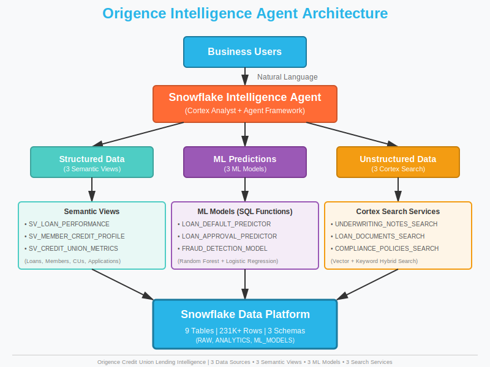
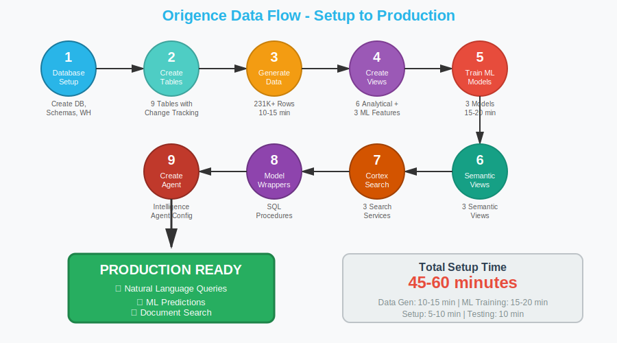

# Origence Intelligence Agent Solution

**Credit Union Lending Intelligence Platform**

This solution provides a complete Snowflake Intelligence Agent implementation for Origence, enabling natural language queries over credit union lending data with ML-powered insights.

---

## 🎯 What This Solution Provides

- **Natural Language Queries**: Ask questions about loans, members, and credit unions in plain English
- **ML-Powered Predictions**: 3 trained models for loan default risk, approval prediction, and fraud detection
- **Unstructured Data Search**: Cortex Search over loan documents, underwriting notes, and policies
- **Semantic Layer**: Cortex Analyst with semantic views for accurate text-to-SQL conversion

---

## 📊 Data Model

### Core Entities
1. **CREDIT_UNIONS** - Credit union partners (1,100+ CUs)
2. **MEMBERS** - Credit union members (66M+ represented)
3. **LOAN_APPLICATIONS** - Consumer and auto loan applications
4. **LOANS** - Funded loans ($593B+ total funding)
5. **DEALERS** - Automotive dealerships (20,000+)
6. **LOAN_OFFICERS** - Lending team members
7. **UNDERWRITING_NOTES** - Unstructured decision rationale
8. **LOAN_DOCUMENTS** - Unstructured loan documentation
9. **COMPLIANCE_POLICIES** - Regulatory and policy documents

### ML Models
1. **LOAN_DEFAULT_PREDICTOR** - Predicts default risk (0=Low, 1=Medium, 2=High, 3=Critical)
2. **LOAN_APPROVAL_PREDICTOR** - Predicts approval likelihood (0=Likely Deny, 1=Review, 2=Likely Approve)
3. **FRAUD_DETECTION_MODEL** - Identifies suspicious applications (0=Clean, 1=Suspicious, 2=High Risk)

---

## 🚀 Setup Instructions

### Prerequisites
- Snowflake account with ACCOUNTADMIN access
- Warehouse (recommended: MEDIUM or larger for data generation)
- Snowflake Notebook environment (for ML models)

### Step 1: Database and Schema Setup
```sql
-- Run this first
snow sql -f sql/setup/01_database_and_schema.sql
```

Creates:
- Database: `ORIGENCE_INTELLIGENCE`
- Schemas: `RAW`, `ANALYTICS`, `ML_MODELS`
- Warehouse: `ORIGENCE_WH`

### Step 2: Create Tables
```sql
snow sql -f sql/setup/02_create_tables.sql
```

Creates 9 core tables with proper constraints and change tracking.

### Step 3: Generate Synthetic Data
```sql
-- This takes 5-10 minutes
snow sql -f sql/data/03_generate_synthetic_data.sql
```

Generates:
- 1,100 credit unions
- 100,000 members
- 50,000 loan applications
- 35,000 funded loans
- 20,000 dealers
- 250 loan officers
- 15,000 underwriting notes
- 10,000 loan documents
- 50 compliance policies

### Step 4: Create Analytical Views
```sql
snow sql -f sql/views/04_create_views.sql
```

Creates:
- 6 analytical views
- 3 ML feature views (for model training)

### Step 5: Train ML Models
1. Upload `notebooks/origence_ml_models.ipynb` to Snowflake
2. Run all cells in the notebook
3. Verify 3 models are registered in Model Registry

### Step 6: Create Semantic Views
```sql
-- IMPORTANT: Syntax verified against Snowflake docs
snow sql -f sql/views/05_create_semantic_views.sql
```

Creates 3 semantic views for Cortex Analyst:
- `SV_LOAN_PERFORMANCE`
- `SV_MEMBER_CREDIT_PROFILE`
- `SV_CREDIT_UNION_METRICS`

### Step 7: Create Cortex Search Services
```sql
snow sql -f sql/search/06_create_cortex_search.sql
```

Creates 3 search services:
- `UNDERWRITING_NOTES_SEARCH`
- `LOAN_DOCUMENTS_SEARCH`
- `COMPLIANCE_POLICIES_SEARCH`

### Step 8: Create ML Model Wrapper Functions
```sql
snow sql -f sql/ml/07_create_model_wrapper_functions.sql
```

Creates SQL procedures to call ML models from the agent:
- `PREDICT_LOAN_DEFAULT_RISK()`
- `PREDICT_LOAN_APPROVAL()`
- `DETECT_FRAUD_RISK()`

### Step 9: Create Intelligence Agent
```sql
snow sql -f sql/agent/08_create_intelligence_agent.sql
```

Creates the Origence Intelligence Agent with all tools configured.

---

## 💬 Sample Questions

### Simple Questions (Direct Data Queries)
1. How many loan applications did we receive this month?
2. What is the average loan amount for auto loans?
3. Which credit unions have the highest loan volumes?
4. Show me the top 5 dealers by loan count
5. What is our current loan approval rate?

### Complex Questions (Multi-table Analysis)
1. What is the month-over-month growth in loan originations by credit union tier?
2. Compare approval rates across different credit score bands and loan types
3. Which dealers have the highest average loan amounts and lowest default rates?
4. Show me loan performance trends by member age group and loan purpose
5. What is the relationship between debt-to-income ratio and loan defaults?

### ML Model Questions (Predictions)
1. Predict the default risk for auto loans in the pipeline
2. Which loan applications in review status are most likely to be approved?
3. Identify potentially fraudulent applications submitted in the last 30 days
4. What is the predicted default rate for loans with DTI > 40%?
5. Show me high-risk loans that were approved in the last quarter

---

## 📁 File Structure

```
origence-intelligence-agent/
├── ORIGENCE_README.md (this file)
├── Snowflake_Logo.svg
├── sql/
│   ├── setup/
│   │   ├── origence_01_database_and_schema.sql
│   │   └── origence_02_create_tables.sql
│   ├── data/
│   │   └── origence_03_generate_synthetic_data.sql
│   ├── views/
│   │   ├── origence_04_create_views.sql
│   │   └── origence_05_create_semantic_views.sql
│   ├── search/
│   │   └── origence_06_create_cortex_search.sql
│   ├── ml/
│   │   └── origence_07_model_wrapper_functions.sql
│   └── agent/
│       └── origence_08_create_intelligence_agent.sql
├── notebooks/
│   └── origence_ml_models.ipynb
└── docs/
    ├── ORIGENCE_SETUP_GUIDE.md
    ├── origence_questions.md
    ├── architecture_diagram.svg
    └── setup_flow_diagram.svg
```

---

## 📐 Architecture Diagrams

### System Architecture


*The Origence Intelligence Agent connects business users to structured data (via semantic views), ML predictions (via 3 models), and unstructured data (via Cortex Search), all powered by the Snowflake Data Platform.*

### Setup Flow


*Complete setup process from database creation to production-ready agent in 9 steps, taking approximately 45-60 minutes.*

---

## ⚠️ Important Notes

1. **Semantic View Syntax**: All semantic view DDL has been verified against official Snowflake documentation
2. **ML Models**: Require `snowflake-ml-python` package in notebook environment
3. **Cortex Search**: Requires change tracking enabled on source tables (automatically configured)
4. **Agent Tools**: All 3 ML models are registered as tools in the Intelligence Agent
5. **Data Volume**: Synthetic data generation creates ~211,250 rows across all tables

---

## 🔒 Security & Compliance

- All data is synthetic and for demonstration purposes
- Role-based access control (RBAC) configured
- Semantic models respect underlying table permissions
- Cortex Search uses owner's rights security model

---

## 📈 Cost Considerations

- **Warehouse Compute**: Data generation ~10 credits (MEDIUM warehouse)
- **ML Training**: ~5-10 credits (depends on data volume)
- **Cortex Search**: Per-query cost + storage
- **Intelligence Agent**: Per-message cost

---

## 🆘 Troubleshooting

### Semantic View Errors
- Verify all column names match table definitions exactly
- Check that feature views exist before referencing in metrics
- Use lowercase table aliases consistently

### ML Model Errors
- Ensure models are registered with `target_platforms=['WAREHOUSE']` for SQL inference
- Verify feature view column names match model training columns exactly

### Cortex Search Errors
- Confirm change tracking is enabled on source tables
- Verify warehouse has sufficient capacity for indexing

---

## 📞 Support

For questions or issues:
1. Check the SETUP_GUIDE.md for detailed instructions
2. Review Snowflake documentation for syntax validation
3. Verify all prerequisites are met

---

**Created for**: Origence (Credit Union Service Organization)  
**Purpose**: Demonstrating Snowflake Intelligence Agent capabilities for lending operations  
**Version**: 1.0.0  
**Last Updated**: December 2025
